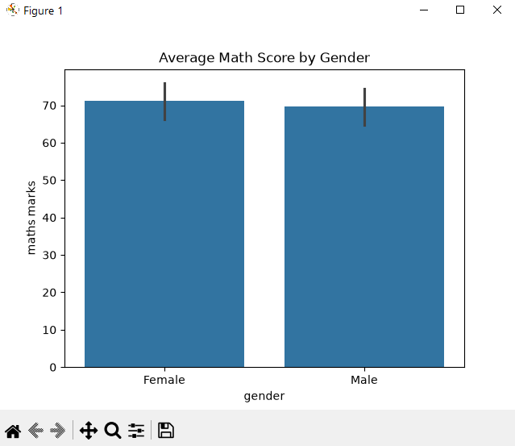
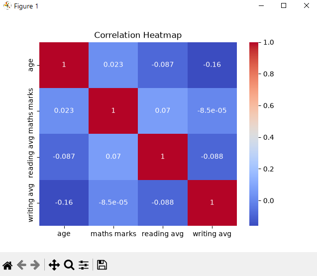
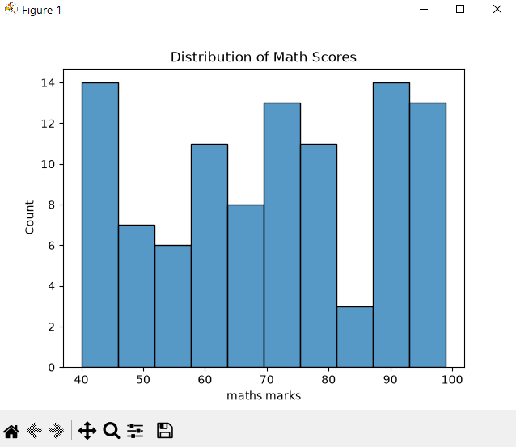

# 📊 Student Performance Analysis


---

## 🚀 Project Overview

This project analyzes student performance data to uncover patterns and insights that influence academic results.
It focuses on **data cleaning, exploratory data analysis (EDA), and visualization** using Python.

---

## 🎯 Objectives

✔️ Analyze subject-wise performance (Math, Reading, Writing)
✔️ Identify factors affecting student scores
✔️ Compare performance across different groups
✔️ Create meaningful visualizations

---

## 🧰 Tech Stack

| Tool          | Purpose                |
| ------------- | ---------------------- |
| 🐍 Python     | Core programming       |
| 📊 Pandas     | Data manipulation      |
| 🔢 NumPy      | Numerical operations   |
| 📉 Matplotlib | Basic visualization    |
| 🎨 Seaborn    | Advanced visualization |

---

## 📁 Dataset Features

* Gender
* Test Preparation Course
* Math Score
* Reading Score
* Writing Score

---

## 🔍 Analysis Workflow

### 🧹 Data Cleaning

* Checked missing values
* Verified data types
* Ensured consistency

### 📊 Exploratory Data Analysis

* Average scores
* Min & Max values
* Score distributions

### 👥 Group Analysis

* Gender-based comparison
* Test preparation impact

---

## 📈 Visualizations

✨ Key visual outputs:

* 📊 Bar Charts → Average scores by category
* 📈 Histograms → Score distribution
* 🔥 Heatmap → Correlation between subjects
* 📦 Boxplots → Group comparison

---

## 💡 Key Insights

* 📌 Students who completed test preparation scored higher
* 📌 Reading & writing scores are strongly correlated
* 📌 Math scores are comparatively lower
* 📌 Performance varies across different student groups

---

## 📂 Project Structure

```
student-performance-analysis/
│
├── students.csv
├── analysis.ipynb
├── README.md
```

---

## ⚙️ How to Run

```bash
git clone https://github.com/shruti875/Student-Performance-Analysis.git
cd student-performance-analysis
pip install pandas numpy matplotlib seaborn
you can run this in notebook or vs code
jupyter notebook
```

---

📸 Project Screenshots
📊 Bar Chart
<p align="center">
  
</p>
🔥 Heatmap
<p align="center">
  
</p>
📈 Histogram
<p align="center">
  
</p>

## 🌟 Future Enhancements

* 🚀 Build interactive dashboard using Streamlit
* 📊 Add more datasets for deeper insights
* 🤖 Apply machine learning for score prediction


## ⭐ Support

If you like this project, give it a ⭐ on GitHub!
